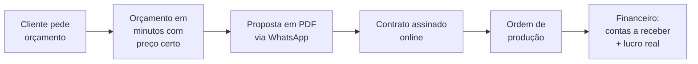
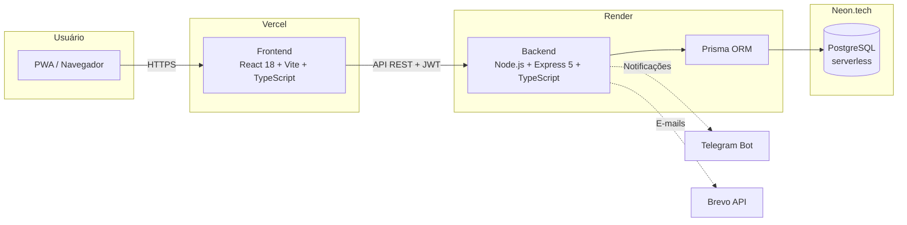

<div class="flex flex-col items-center justify-center h-full">

<div v-motion :initial="{ y: -40, opacity: 0 }" :enter="{ y: 0, opacity: 1, transition: { duration: 600 } }" class="bg-white rounded-2xl px-12 py-4 shadow-2xl">
  
</div>

<h1 v-motion :initial="{ opacity: 0, scale: 0.9 }" :enter="{ opacity: 1, scale: 1, transition: { delay: 300, duration: 600 } }" class="!text-5xl pt-10">
Gestão Inteligente para Marcenarias
</h1>

<div v-motion :initial="{ opacity: 0 }" :enter="{ opacity: 1, transition: { delay: 700, duration: 600 } }" class="text-xl opacity-80">
Do orçamento ao contrato assinado em minutos, não em dias
</div>

<div class="pt-14 text-sm opacity-60">
Kevin Rhoden · Daniel Cousseau · Victor de Amorim Rodrigues
<br>
Turma TI23
</div>

</div>

<!--
BLOCO 1 - KEVIN (~5 min)
Abertura: cumprimentar a banca, apresentar o grupo, dizer o nome do projeto.
"Hoje vamos apresentar o OrçaPro, um sistema que resolve um problema real
de um mercado de mais de 300 mil marcenarias no Brasil."
-->

---
layout: center
class: text-center
---

# O Problema

<div class="grid grid-cols-3 gap-8 pt-10">
<v-clicks>
<div class="glass p-6">
  <h3>Orçamentos no papel</h3>
  <p class="text-sm opacity-70 pt-2">O marceneiro calcula material, mão de obra e margem à mão. Quando erra, o prejuízo é dele.</p>
</div>
<div class="glass p-6">
  <h3>Dias para responder</h3>
  <p class="text-sm opacity-70 pt-2">O cliente espera dias pelo orçamento e acaba fechando com o concorrente mais rápido.</p>
</div>
<div class="glass p-6">
  <h3>Falta de controle</h3>
  <p class="text-sm opacity-70 pt-2">Sem saber quais projetos dão lucro, quanto tem a receber, nem onde perde cliente.</p>
</div>
</v-clicks>
</div>

<!--
Cada cartão aparece com um clique. Contar uma história: "Imaginem o seu Zé,
marceneiro há 20 anos. Ele faz móveis incríveis, mas perde clientes porque
demora 3 dias para entregar um orçamento feito à mão. E quando entrega,
às vezes errou a conta e trabalha no prejuízo."
Dados de mercado: setor moveleiro brasileiro fatura bilhões, mas é um dos
menos digitalizados.
-->

---
layout: center
class: text-center
transition: fade
---

# A Solução

<div class="text-2xl pt-4 pb-8 opacity-90">
Um sistema completo que acompanha a marcenaria<br>
<b>do primeiro contato ao dinheiro no bolso</b>
</div>



<!--
Frase de efeito: "O OrçaPro transforma o caderninho do marceneiro em uma
operação digital completa." Mencionar que é um SaaS: a marcenaria assina
e usa pelo navegador ou celular, sem instalar nada.
-->

---

# Para quem? O mercado

<div class="grid grid-cols-2 gap-10 pt-4">
<div>

## Público-alvo

<v-clicks>

- Marcenarias de pequeno e médio porte
- Marceneiros autônomos
- Movelarias sob medida

</v-clicks>

## Modelo de negócio

<v-clicks>

- **SaaS por assinatura mensal**
- Multi-tenant: um sistema, várias marcenarias, dados totalmente isolados
- Acesso via navegador e celular (PWA, funciona como aplicativo)

</v-clicks>

</div>
<div>

## Diferenciais

| Concorrentes               | OrçaPro                                      |
| -------------------------- | -------------------------------------------- |
| Genéricos (qualquer setor) | Feito **para marcenaria**                    |
| Só orçamento               | Orçamento, contrato, produção e financeiro   |
| Caros e complexos          | Simples, em português, preço acessível       |

</div>
</div>

<!--
BLOCO 1 fecha aqui. Transição: "E como isso funciona na prática?
O Daniel vai mostrar o sistema para vocês."
-->

---
layout: section
transition: slide-up
---

# O Produto em Ação

<!--
BLOCO 2 - DANIEL (~5 min)
Tour pelas telas. Os placeholders serão trocados pelos prints reais do sistema.
-->

---
layout: image-right
image: /prints/dashboard.svg
---

# Dashboard

O centro de comando da marcenaria

<v-clicks>

- Visão geral do mês: orçamentos, aprovações, faturamento
- Gráficos de desempenho
- Alertas de estoque baixo
- Ordens de produção em andamento

</v-clicks>

<!--
"Assim que o marceneiro faz login, ele vê a saúde do negócio em uma tela."
-->

---
layout: image-right
image: /prints/novo-orcamento.svg
---

# Orçamento Inteligente

De 3 dias para 5 minutos

<v-clicks>

- Materiais com preço atualizado do estoque
- Mão de obra e margem de lucro calculadas automaticamente
- Plano de corte de peças integrado
- Sem erro de cálculo

</v-clicks>

<!--
Ponto comercial forte: "o sistema garante que o marceneiro nunca mais
venda no prejuízo, porque a margem está embutida no cálculo".
-->

---
layout: image-right
image: /prints/proposta.svg
---

# Proposta Profissional

A cara da marcenaria, não do papel de pão

<v-clicks>

- PDF com a logo da marcenaria
- Envio direto por WhatsApp
- Cliente aprova online

</v-clicks>

<!--
Mostrar antes/depois se possível: orçamento à mão vs PDF do OrçaPro.
-->

---
layout: image-right
image: /prints/contrato.svg
---

# Contrato Automático

Aprovou? Contrato pronto na hora

<v-clicks>

- Gerado automaticamente ao aprovar o orçamento
- Cliente assina online por um link único e seguro
- Sem papel, sem cartório, sem espera

</v-clicks>

---
layout: image-right
image: /prints/kanban.svg
---

# Kanban de Projetos

Nenhum projeto esquecido

<v-clicks>

- Arrastar e soltar entre etapas
- Notificações automáticas no Telegram
- Funil de vendas visível: do contato ao entregue

</v-clicks>

---
layout: image-right
image: /prints/financeiro.svg
---

# Financeiro e Produção

O dinheiro sob controle

<v-clicks>

- Contas a receber por projeto
- Rentabilidade real: quanto lucrou em cada móvel
- Ordem de produção imprimível para a oficina
- Estoque com alerta de nível baixo

</v-clicks>

<!--
BLOCO 2 fecha aqui. Transição: "Tudo isso que vocês viram roda em uma
arquitetura profissional de verdade, em produção. O Victor vai mostrar
como construímos."
-->

---
layout: section
transition: slide-up
---

# Por Dentro da Máquina

<!--
BLOCO 3 - VICTOR (~4 min + 1 min de conclusão)
Parte técnica: arquitetura, segurança, qualidade. É o que os professores avaliam.
-->

---

# Arquitetura

<div class="pt-4">



</div>

<div class="text-sm opacity-70 pt-2 text-center">
100% TypeScript · Deploy contínuo com GitHub Actions · Em produção real
</div>

<!--
Explicar em 30s: "O usuário acessa pelo navegador, o frontend em React
conversa com nossa API em Node.js, e os dados ficam em um PostgreSQL
na nuvem. Tudo tipado com TypeScript de ponta a ponta."
-->

---

# Segurança em primeiro lugar

<div class="grid grid-cols-2 gap-8 pt-4">
<div>

## Autenticação

<v-clicks>

- JWT em cookie httpOnly com refresh tokens
- Sessão de 15 min renovada automaticamente
- Recuperação de senha por e-mail
- Cloudflare Turnstile contra robôs no cadastro

</v-clicks>

## Proteções

<v-clicks>

- Rate limit: bloqueio após 10 tentativas de login
- Helmet.js e Content Security Policy
- Validação de toda entrada com Zod

</v-clicks>

</div>
<div>

## Isolamento multi-tenant

Cada marcenaria só enxerga os próprios dados:

```typescript
// TODA query filtra pelo tenant
const orcamentos = await prisma.orcamento.findMany({
  where: { userId: req.userId }
})
```

- Validação cross-tenant testada automaticamente
- Audit Log: toda ação registrada (LGPD)

</div>
</div>

<!--
Ponto forte para professores: "escrevemos testes que tentam acessar dados
de outra marcenaria de propósito, e eles comprovam que o sistema bloqueia".
-->

---

# Qualidade e desafios superados

<div class="grid grid-cols-2 gap-8 pt-4">
<div>

## Qualidade

<v-clicks>

- Testes automatizados (Jest + Supertest) contra banco real
- TypeScript estrito no front e no back
- CI/CD: cada push valida tipos e testes

</v-clicks>

## Escala do projeto

<v-clicks>

- 20 telas no frontend
- 7 controllers e mais de 40 endpoints na API
- 5 migrações de banco versionadas

</v-clicks>

</div>
<div>

## Desafios reais que resolvemos

<v-clicks>

- **Safari bloqueia cookies cross-domain**: token em memória e refresh no localStorage
- **Servidor bloqueia porta de e-mail**: migramos de SMTP para API HTTP
- **PDF no celular**: geração no navegador com html2pdf.js
- **Banco serverless**: connection pooling do Neon.tech

</v-clicks>

</div>
</div>

<!--
Este slide mostra maturidade: problemas que só aparecem em produção de verdade.
A banca valoriza muito "o que deu errado e como resolvemos".
-->

---
layout: center
class: text-center
transition: fade
---

# Próximos Passos

<div class="grid grid-cols-4 gap-4 pt-8 text-sm">
<v-clicks>
<div class="glass p-4">
<b>Assinaturas</b><br>Pagar.me: Pix, boleto e cartão
</div>
<div class="glass p-4">
<b>WhatsApp nativo</b><br>Notificações via EvolutionAPI
</div>
<div class="glass p-4">
<b>Assinatura digital</b><br>Contratos com validade jurídica
</div>
<div class="glass p-4">
<b>Fluxo de caixa</b><br>Projeção 30/60/90 dias
</div>
</v-clicks>
</div>

<!--
"O OrçaPro já está em produção e pronto para os primeiros clientes pagantes."
-->

---
layout: center
class: text-center
---

<div class="flex flex-col items-center">

<div v-motion :initial="{ opacity: 0, y: -20 }" :enter="{ opacity: 1, y: 0, transition: { duration: 600 } }" class="bg-white rounded-2xl px-10 py-3 shadow-2xl">
  
</div>

# Obrigado!

<div class="text-xl pt-2 opacity-80">
OrçaPro: do orçamento ao contrato assinado
</div>

<div class="pt-8 text-lg">
<b>orca-pro-seven.vercel.app</b>
</div>

<div class="pt-8 text-sm opacity-60">
Kevin Rhoden · Daniel Cousseau · Victor de Amorim Rodrigues - TI23
</div>

<div class="pt-6 text-lg">
Perguntas?
</div>

</div>

<!--
Encerramento: agradecer a banca, se colocar à disposição para perguntas.
Combinar antes quem responde o quê: comercial com Kevin,
produto com Daniel, técnico com Victor.
-->
