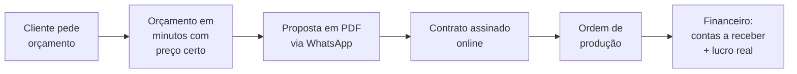
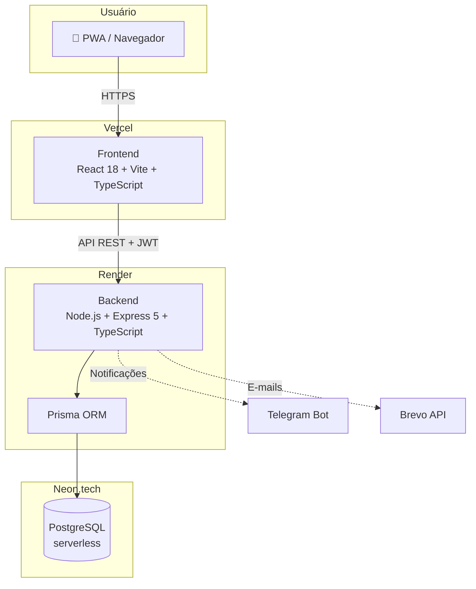

# OrçaPro

## Gestão Inteligente para Marcenarias

<div class="pt-8 text-xl opacity-80">
Do orçamento ao contrato assinado — em minutos, não em dias
</div>

<div class="pt-12 text-sm opacity-60">
[NOME 1] · [NOME 2] · Victor de Amorim Rodrigues
<br>
Turma TI23
</div>

<!--
BLOCO 1 — APRESENTADOR 1 (~5 min)
Abertura: cumprimentar a banca, apresentar o grupo, dizer o nome do projeto.
"Hoje vamos apresentar o OrçaPro, um sistema que resolve um problema real
de um mercado de mais de 300 mil marcenarias no Brasil."
-->

---
layout: center
class: text-center
---

# O Problema

<div class="grid grid-cols-3 gap-8 pt-10">
<div class="p-6 rounded-xl bg-red-500 bg-opacity-10">
  <div class="text-4xl pb-2">📝</div>
  <h3>Orçamentos no papel</h3>
  <p class="text-sm opacity-70">Marceneiro calcula material, mão de obra e margem à mão — erra e perde dinheiro</p>
</div>
<div class="p-6 rounded-xl bg-red-500 bg-opacity-10">
  <div class="text-4xl pb-2">⏱️</div>
  <h3>Dias para responder</h3>
  <p class="text-sm opacity-70">Cliente espera dias pelo orçamento e fecha com o concorrente mais rápido</p>
</div>
<div class="p-6 rounded-xl bg-red-500 bg-opacity-10">
  <div class="text-4xl pb-2">📉</div>
  <h3>Zero controle</h3>
  <p class="text-sm opacity-70">Não sabe quais projetos dão lucro, quanto tem a receber, nem onde perde cliente</p>
</div>
</div>

<!--
Contar uma história: "Imaginem o seu Zé, marceneiro há 20 anos. Ele faz móveis
incríveis, mas perde clientes porque demora 3 dias para entregar um orçamento
feito à mão — e quando entrega, às vezes errou a conta e trabalha no prejuízo."
Dados de mercado: setor moveleiro brasileiro fatura bilhões, mas é um dos
menos digitalizados.
-->

---
layout: center
class: text-center
---

# A Solução

<div class="text-2xl pt-4 pb-8 opacity-90">
Um sistema completo que acompanha a marcenaria<br>
<b>do primeiro contato ao dinheiro no bolso</b>
</div>



<!--
Frase de efeito: "O OrçaPro transforma o caderninho do marceneiro em uma
operação digital completa." Mencionar que é um SaaS: a marcenaria assina
e usa pelo navegador ou celular, sem instalar nada.
-->

---

# Para quem? O mercado

<div class="grid grid-cols-2 gap-10 pt-4">
<div>

## 🎯 Público-alvo

- Marcenarias de pequeno e médio porte
- Marceneiros autônomos
- Movelarias sob medida

## 💰 Modelo de negócio

- **SaaS por assinatura mensal**
- Multi-tenant: um sistema, várias marcenarias, dados 100% isolados
- Acesso via navegador e celular (PWA — funciona como app)

</div>
<div>

## 📊 Diferenciais

| Concorrentes | OrçaPro |
| --- | --- |
| Genéricos (qualquer setor) | Feito **para marcenaria** |
| Só orçamento | Orçamento → contrato → produção → financeiro |
| Caros e complexos | Simples, em português, preço acessível |

</div>
</div>

<!--
BLOCO 1 fecha aqui. Transição: "E como isso funciona na prática?
O [NOME 2] vai mostrar o sistema para vocês."
-->

---
layout: section
---

# O Produto em Ação

<!--
BLOCO 2 — APRESENTADOR 2 (~5 min)
Tour pelas telas com prints. Cada slide a seguir recebe um print real do sistema.
-->

---
layout: image-right
image: /prints/dashboard.png
---

# Dashboard

O centro de comando da marcenaria

- Visão geral do mês: orçamentos, aprovações, faturamento
- Gráficos de desempenho (Chart.js)
- Alertas de estoque baixo
- Ordens de produção em andamento

<!--
"Assim que o marceneiro faz login, ele vê a saúde do negócio em uma tela."
-->

---
layout: image-right
image: /prints/novo-orcamento.png
---

# Orçamento Inteligente

De 3 dias para 5 minutos

- Materiais com preço atualizado do estoque
- Mão de obra + margem de lucro calculadas automaticamente
- Plano de corte de peças integrado
- Erro de cálculo: **zero**

<!--
Ponto comercial forte: "o sistema garante que o marceneiro nunca mais
venda no prejuízo, porque a margem está embutida no cálculo".
-->

---
layout: image-right
image: /prints/proposta.png
---

# Proposta Profissional

A cara da marcenaria, não do papel de pão

- PDF com a logo da marcenaria
- Envio direto por WhatsApp
- Cliente aprova online

<!--
Mostrar antes/depois se possível: orçamento à mão vs PDF do OrçaPro.
-->

---
layout: image-right
image: /prints/contrato.png
---

# Contrato Automático

Aprovou? Contrato pronto na hora

- Gerado automaticamente ao aprovar o orçamento
- Cliente assina online por um link único e seguro
- Sem papel, sem cartório, sem espera

---
layout: image-right
image: /prints/kanban.png
---

# Kanban de Projetos

Nenhum projeto esquecido

- Arrastar e soltar entre etapas
- Notificações automáticas no Telegram
- Funil de vendas visível: do contato ao entregue

---
layout: image-right
image: /prints/financeiro.png
---

# Financeiro e Produção

O dinheiro sob controle

- Contas a receber por projeto
- Rentabilidade real: quanto **lucrou** em cada móvel
- Ordem de produção imprimível para a oficina
- Estoque com alerta de nível baixo

<!--
BLOCO 2 fecha aqui. Transição: "Tudo isso que vocês viram roda em uma
arquitetura profissional de verdade, em produção. O [NOME 3] vai mostrar
como construímos."
-->

---
layout: section
---

# Por Dentro da Máquina

<!--
BLOCO 3 — APRESENTADOR 3 (~4 min + 1 min de conclusão)
Parte técnica: arquitetura, segurança, qualidade. É o que os professores avaliam.
-->

---

# Arquitetura

<div class="pt-4">



</div>

<div class="text-sm opacity-70 pt-2 text-center">
100% TypeScript · Deploy contínuo com GitHub Actions · Em produção real
</div>

<!--
Explicar em 30s: "O usuário acessa pelo navegador, o frontend em React
conversa com nossa API em Node.js, e os dados ficam em um PostgreSQL
na nuvem. Tudo tipado com TypeScript de ponta a ponta."
-->

---

# Segurança: prioridade nº 1

<div class="grid grid-cols-2 gap-8 pt-4">
<div>

## 🔐 Autenticação

- JWT em cookie httpOnly + refresh tokens
- Sessão de 15 min renovada automaticamente
- Recuperação de senha por e-mail
- Cloudflare Turnstile contra robôs no cadastro

## 🛡️ Proteções

- Rate limit: bloqueio após 10 tentativas de login
- Helmet.js + Content Security Policy
- Validação de toda entrada com Zod

</div>
<div>

## 🏢 Isolamento multi-tenant

Cada marcenaria só enxerga os próprios dados:

```typescript
// TODA query filtra pelo tenant
const orcamentos = await prisma.orcamento.findMany({
  where: { userId: req.userId } // 🔒
})
```

- Validação cross-tenant testada automaticamente
- Audit Log: toda ação registrada (LGPD)

</div>
</div>

<!--
Ponto forte para professores: "escrevemos testes que tentam acessar dados
de outra marcenaria de propósito — e comprovam que o sistema bloqueia".
-->

---

# Qualidade e desafios superados

<div class="grid grid-cols-2 gap-8 pt-4">
<div>

## ✅ Qualidade

- Testes automatizados (Jest + Supertest) contra banco real
- TypeScript estrito no front e no back
- CI/CD: cada push valida tipos e testes

## 📦 Escala do projeto

- 20 telas no frontend
- 7 controllers, +40 endpoints na API
- 5 migrações de banco versionadas

</div>
<div>

## 🧗 Desafios reais que resolvemos

- **Safari bloqueia cookies cross-domain** → token em memória + refresh no localStorage
- **Servidor bloqueia porta de e-mail** → migração de SMTP para API HTTP
- **PDF no celular** → geração no navegador com html2pdf.js
- **Banco serverless** → connection pooling do Neon.tech

</div>
</div>

<!--
Este slide mostra maturidade: problemas que só aparecem em produção de verdade.
A banca valoriza muito "o que deu errado e como resolvemos".
-->

---
layout: center
class: text-center
---

# Próximos Passos

<div class="grid grid-cols-4 gap-4 pt-8 text-sm">
<div class="p-4 rounded-xl bg-blue-500 bg-opacity-10">
💳<br><b>Assinaturas</b><br>Pagar.me: Pix, boleto e cartão
</div>
<div class="p-4 rounded-xl bg-blue-500 bg-opacity-10">
💬<br><b>WhatsApp nativo</b><br>Notificações via EvolutionAPI
</div>
<div class="p-4 rounded-xl bg-blue-500 bg-opacity-10">
✍️<br><b>Assinatura digital</b><br>Contratos com validade jurídica
</div>
<div class="p-4 rounded-xl bg-blue-500 bg-opacity-10">
📈<br><b>Fluxo de caixa</b><br>Projeção 30/60/90 dias
</div>
</div>

<!--
"O OrçaPro já está em produção e pronto para os primeiros clientes pagantes."
-->

---
layout: center
class: text-center
---

# Obrigado!

<div class="text-xl pt-4 opacity-80">
OrçaPro — do orçamento ao contrato assinado
</div>

<div class="pt-8">
🌐 <b>orca-pro-seven.vercel.app</b>
</div>

<div class="pt-10 text-sm opacity-60">
[NOME 1] · [NOME 2] · Victor de Amorim Rodrigues — TI23
</div>

<div class="pt-6 text-lg">
Perguntas?
</div>

<!--
Encerramento: agradecer a banca, se colocar à disposição para perguntas.
Combinar antes quem responde o quê: comercial → apresentador 1,
produto → apresentador 2, técnico → apresentador 3.
-->
